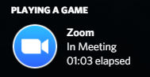

# ZoomInClass

[Click here for English README](README.md)

[Zoom](https://zoom.us/) でミーティングを行っている時に、[Discord Rich Presence](https://discord.com/developers/docs/rich-presence/how-to) を使用して表示します。

## Warning

このアプリケーションは、個人的な使用のみを目的として作成されています。動作の正確性は保証できません。  
また、ミーティングを行っているかどうかは、ウィンドウのタイトルだけで10秒毎に判断されます。

## Requirements

- Windows 10 (Tested with `Version 1909`, `Build 18363.1316`)
- .NET Framework 4.8
- Discord公式クライアント

## Installation

1. 最新の `ZoomInClass.zip` を [Releases](https://github.com/book000/ZoomInClass/releases) からダウンロードしてください。
2. ダウンロード・展開したファイルを適切なディレクトリに移動します。
3. スタートアップディレクトリ(`shell:startup`)に`ZoomInClass.exe`ファイルへのショートカットを作成します。
4. コンピュータを再起動するか、`ZoomInClass.exe`を起動します。

## Usage

`ZoomInClass.exe` の実行中にZoomミーティングを開始すると、Discordで表示されます。

## Disclaimer

開発者は、このプロジェクトを使用するユーザーによって引き起こされた問題について責任を負いません。

## License

このプロジェクトのライセンスは [MIT License](LICENSE) です。
